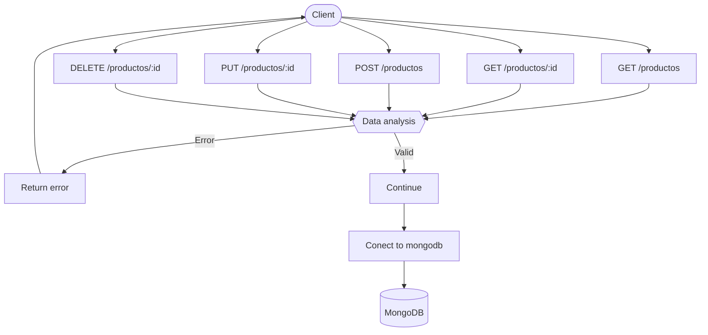

API Supermercado

Esta API permite realizar operaciones CRUD sobre los productos de un supermercado, almacenados en una base de datos MongoDB.

http://localhost:3010

Metodos get:

GET `/`
  Respuesta:
  Bienvenida a la API.

GET `/productos`
  Obtiene la lista completa de productos.

#### Respuesta:
json
[
{
  "_id": {
    "$oid": "6845b9e43ee27ac534427dc9"
  },
  "codigo": 1234,
  "nombre": "Arroz",
  "precio": 5.99,
  "categoria": "Comestible"
},
  ...
]

GET `/productos/:cod`
  Obtiene el prod con el :cod indicado.
  #### Respuesta:
  {
  "codigo": 5678,
  "nombre": "Azúcar",
  "precio": 3.49,
  "categoria": "Comestible"
}

GET `/productos/name/:nombre`
Obtiene el prod con el :nombre indicado.
EJ: http://localhost:3010/productos/name/Detergente
  #### Respuesta:
  {
  "codigo": 9012,
  "nombre": "Detergente",
  "precio": 8.75,
  "categoria": "Limpieza"
}

METODO POST (Agregar un nuevo recurso)
 Formato a enviar:
{
  "codigo": 9012,
  "nombre": "Detergente",
  "precio": 8.75,
  "categoria": "Limpieza"
}
Respuesta:
  201 Nuevo producto creado.
  400 Error en el formato de datos.
  500 Error al conectar a la base de datos

METODO PUT (Modificar un recurso)
Debo enviar el codigo del producto a modificar
EJ: http://localhost:3010/productos/:cod
 Formato a enviar:
{
  "precio": 999
}
Respuesta: 
  200 Datos modificados exitosamente.
  400 Error en el formato de datos.
  404 si el producto no existe.
  500 Error al conectar con Mongo

Metodo DELETE (Eliminar un recurso)
Debo enviar el codigo del producto a eliminar
/productos/:cod
Respuesta: 
  204 Eliminado correctamente.
  400 Error en el formato de datos.
  404 sNo se encontro un recurso con el codigo ingresado.
  500 Error al conectar con Mongo

···Instalación y ejecución···
git clone https://github.com/tu-usuario/supermercado-api.git
npm install: 
  Express
  Dotenv
  Mongodb
node server.js

----

